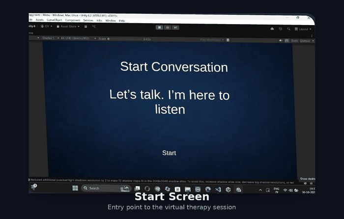
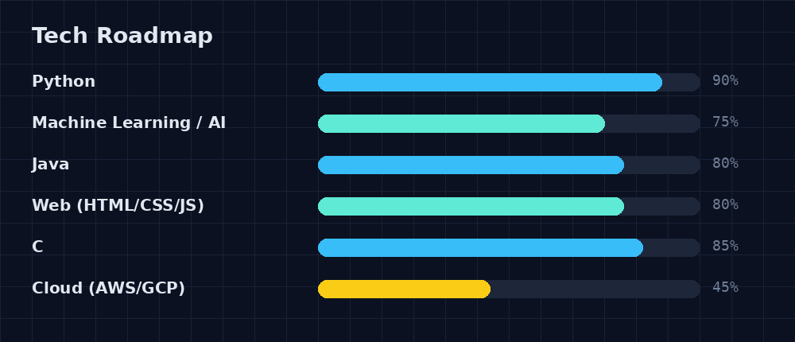
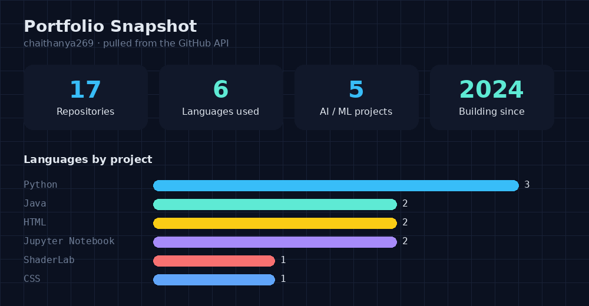
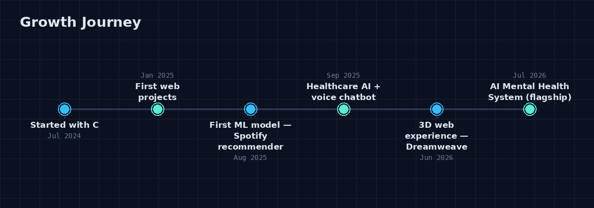

<!-- ============================================================
  SETUP
  1. Repo must be named EXACTLY "Chaithanya269" so GitHub shows
     this as your profile overview.
  2. Upload ALL of these to that repo's root (same folder as
     README.md) — the images are referenced by relative path:
       - README.md
       - girl_coding.gif
       - ai_therapy_slideshow.gif
       - tech_roadmap.png
       - github_stats.png
       - journey_timeline.png
  3. That's it — no GitHub Actions or tokens needed this time.
     Every visual here is a static file, so nothing can "fail to load."
============================================================ -->

 

<table>
<tr>
<td width="60%">

### 🚀 About Me

- 🧠 Built an AI-powered mental health support system with a real-time **3D virtual therapist** (Unity + a fine-tuned DistilBERT model)
- 🌌 Explored WebGL & Three.js by building **Dreamweave**, a scroll-driven 3D concept site
- 📊 Experimented with ML across domains — disease prediction, music recommendation, and communication scoring
- ☁️ Currently deepening my **Cloud (AWS)** fundamentals to take these projects further
- 📫 Reach me at chaithanyareddymv@gmail.com

</td>
<td width="40%">

</td>
</tr>
</table>

## 🌟 Main Project

### 🧠 AI-Driven Mental Health Support System

A virtual therapy assistant that pairs emotion-aware AI with a **Unity-built 3D therapist** — built to make emotional support more accessible and private. A fine-tuned **DistilBERT** model reads the user's emotional state from voice or text, and the 3D character responds in real time with synced speech, lip movement, and expression.

- 🎙️ Voice & text input, with text-to-speech responses spoken back by the therapist
- 🧠 Emotion classification (DistilBERT) reaching **~87.66% accuracy**
- 🧍 Unity-based 3D character with lip-sync and expression animation
- 🔒 Runs locally via FastAPI — no data leaves the device

`DistilBERT` `PyTorch` `FastAPI` `Unity (C#)` `Speech-to-Text/TTS`

Built as part of a 4-person final-year engineering team.
[**View repo →**](https://github.com/Chaithanya269/AI-Driven-Mental-Health-Support-System)

## 🗺️ Tech Roadmap

## 📂 Featured Repos

| Project | What it does | Stack |
|---|---|---|
| **[dreamweave](https://github.com/Chaithanya269/dreamweave)** | A scroll-driven 3D concept site — WebGL scene morphing with Three.js, no framework | `Three.js` `WebGL` `JS` |
| **[Cardio-Vascular-disease-detection](https://github.com/Chaithanya269/Cardio-Vascular-disease-detection)** | ML model predicting cardiovascular disease risk | `Python` `Jupyter` |
| **[Spotify-Recommendation-System](https://github.com/Chaithanya269/Spotify-Recommendation-System)** | Recommends music based on listening data | `Python` `Jupyter` |
| **[TTS](https://github.com/Chaithanya269/TTS)** | A speaking chatbot with text-to-speech output | `Python` |
| **[ai-communication-scorer](https://github.com/Chaithanya269/ai-communication-scorer)** | Scores and analyzes communication quality with AI | `Python` |
| **[expense-tracker](https://github.com/Chaithanya269/expense-tracker)** | Logs and tracks personal expenses | `Python` |

## 📊 GitHub Stats

Generated from the live GitHub API — no third-party widget dependency, so it always renders.

## 🧭 Growth Journey

## 📶 Connect

 

### ✨ Thanks for stopping by! ✨

If something here sparked an idea or you'd like to collaborate, my inbox is always open.

