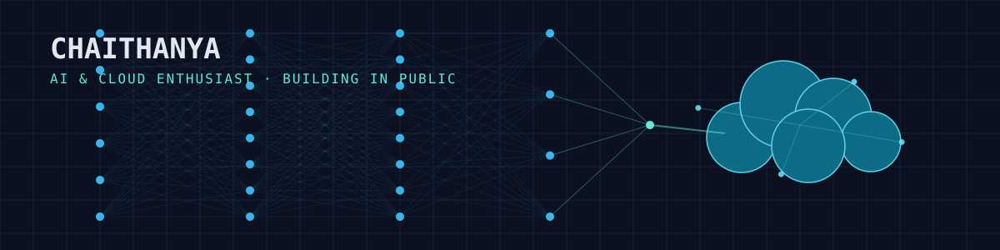
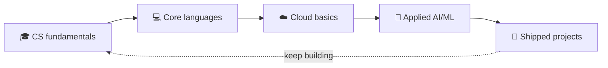

<!-- ============================================================
  SETUP
  1. Create a repo named EXACTLY "Chaithanya269" (must match your
     username) — that's what turns this into your profile overview.
  2. Add this file as README.md, plus banner.svg, to that repo's root.
  3. Fill in YOUR_LINKEDIN / YOUR_EMAIL / YOUR_INSTAGRAM below.
  4. (Optional, for the Live metrics section) add metrics.yml to
     .github/workflows/ in that repo, create a GitHub personal access
     token, save it as a repo secret named METRICS_TOKEN, then run
     the workflow once from the Actions tab.
============================================================ -->

<div align="center">

</div>

<br/>

```bash
$ whoami
> Chaithanya — CS student, building toward AI & Cloud

$ systemctl status growth.service
● growth.service - active (running)
   Status:   learning in public, one repo at a time
   Focus:    core programming -> cloud fundamentals -> applied AI
```

## 📖 git log --oneline learning-journey

```
* c3d9f21 (HEAD -> main) build: exploring cloud deployments on AWS
* 8f4e102 feat: built an expense tracker in Python
* 5a7c883 feat: wrote a network configuration exercise in Java
* 2b91ee4 feat: created a random username generator
* 91caa10 feat: built a word-counting utility
* 0a19d3e Initial commit — started the journey
```

## 📡 Where this is headed



## 🖥️ system.monitor

```
┌─ system.monitor ────────────────────────────────────────────┐
│                                                              │
│  CPU   Python / Java             [███████████████████░]  95%│
│  GPU   C / problem solving        [████████████████░░░░]  80%│
│  NET   AWS / Cloud (in progress)  [████████████░░░░░░░░]  60%│
│  MEM   HTML / CSS                 [█████████████████░░░]  85%│
│                                                              │
└──────────────────────────────────────────────────────────────┘
```

## 🚀 Featured repos

| Project | What it does | Stack |
|---|---|---|
| **[expense-tracker](https://github.com/Chaithanya269/expense-tracker)** | Logs and tracks personal expenses | `Python` |
| **[netwrokconfiguration](https://github.com/Chaithanya269/netwrokconfiguration)** | Network configuration exercise | `Java` |
| **[word-counter1](https://github.com/Chaithanya269/word-counter1)** | Lightweight word-counting utility | `HTML` `CSS` |
| **[Random-Username-Generator](https://github.com/Chaithanya269/Random-Username-Generator)** | Generates random usernames on demand | `HTML` |

## 🛰️ Currently provisioning

- [x] Core programming: C, Java, Python
- [ ] AWS Cloud Practitioner fundamentals
- [ ] Data structures & algorithms mastery
- [ ] First hands-on AI/ML project

## 📊 Live metrics

<sub>Generated nightly by a GitHub Action (see <code>metrics.yml</code>) — an isometric contribution calendar + achievements, instead of the usual stats-card widget.</sub>

<div align="center">

</div>

## 📶 Connect

<div align="center">

[](https://github.com/Chaithanya269)
[](https://linkedin.com/in/YOUR_LINKEDIN)
[](mailto:YOUR_EMAIL)

</div>
